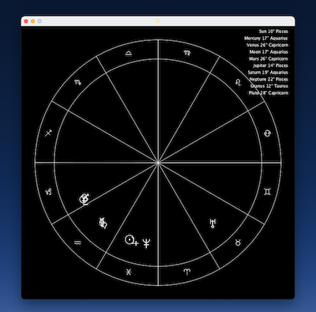

# clj-desktop-astro

## Required

[Leiningen](https://leiningen.org/)

## Dependencies

* [clojure2d](https://github.com/Clojure2D/clojure2d) for visualization
* [fastmath](https://github.com/generateme/fastmath) for calculations
* [astrolin](https://github.com/astrolin/ephemeris)'s Swiss Ephemeris for Clojure

## Usage

`lein run`

## License

[Swiss Ephemeris](https://www.astro.com/swisseph/)
